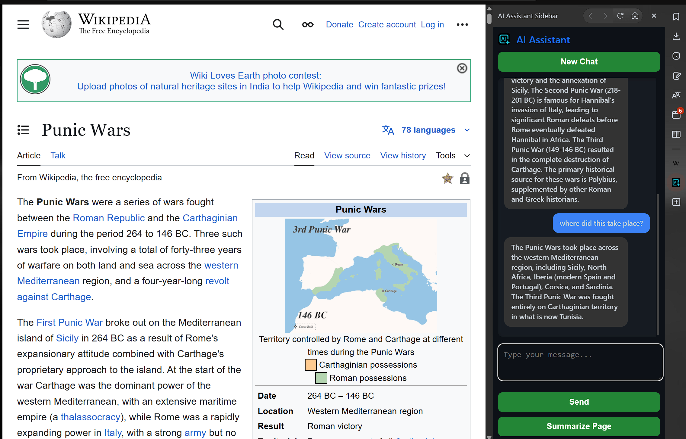

# 🧠 AI Assistant Sidebar Extension

A Chromium-compatible browser sidebar extension that integrates a smart AI assistant powered by Google Gemini. It can answer user queries, summarize web pages, and maintain chat history — all from a sleek in-browser interface.

---

## 📌 Overview

This project demonstrates full-stack integration of a modern AI system with frontend and backend components. It highlights practical skills in:

* 🧠 Conversational AI using **Gemini (Google Generative AI)**
* 🧱 Web extension architecture
* 🌐 RESTful API backend using Flask
* 📦 Local chat history storage and summarization tools

---

## 🎯 Use Case

An always-available assistant in your browser to:

* Answer questions
* Summarize articles or selected text
* Store chat history for future reference

---

## 🔧 Tech Stack

| Layer         | Technology                              |
| ------------- | --------------------------------------- |
| **Frontend**  | HTML, CSS, JavaScript (Vanilla)         |
| **Backend**   | Python (Flask, Flask-CORS)              |
| **AI Engine** | Google Gemini via `google-generativeai` |
| **Storage**   | JSON (chat log files)                   |
| **Extension** | Chrome/Chromium-compatible popup        |

---

## 🚀 Features

✅ Ask questions in natural language
✅ Summarize any webpage in one click
✅ Use keyboard shortcuts (Ctrl + Enter) to send
✅ Persistent chat history using Chrome local storage
✅ Daily log storage with timestamped JSON files

---

## ⚙️ How to Run

### 1. Clone the Repo

```bash
git clone https://github.com/rocx77/AI_Sidebar.git
cd ai-assistant-sidebar
```

### 2. Install Python Requirements

```bash
pip install -r requirements.txt
```

### 3. Add `.env` File

Create a `.env` file with your Gemini API key:

```
GOOGLE_API_KEY=your_api_key_here
```

### 4. Run Backend

```bash
python app.py
```

The backend runs on: `http://127.0.0.1:5000`

### 5. Load the Extension in Chrome

1. Go to `chrome://extensions`
2. Enable **Developer Mode**
3. Click **Load Unpacked**
4. Select the folder containing `sidebar.html` and `sidebar.js`

---

## 📸 Screenshots


> 
---

## 💼 Resume Highlights

* Built an AI assistant using **Google Gemini 2.5 Flash**
* Developed a full-stack browser extension with custom frontend + Flask API
* Implemented **context-aware summarization** of live web content
* Used **Chrome Storage API** and local JSON logging for persistent data
* Applied best practices for asynchronous fetch and modular backend design

---

## 📜 License

This project is licensed under the MIT License.

---
